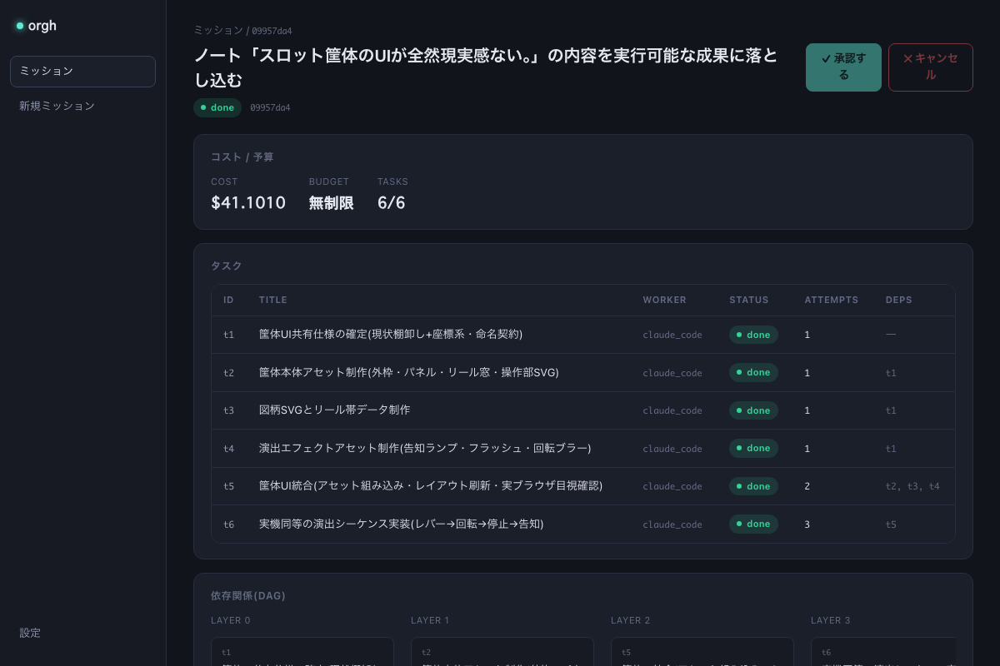

# orgh — 自律増幅型AI組織ハーネス

Obsidian/メモ → 意図解釈 → 計画(DAG) → Claude Code / Codex セッション並列起動 → レビュー → 差し戻し改善ループ → 学習の蒸留、までを1コマンドで回す。

> **EN**: An agent-orchestration harness that turns plain notes into executed missions: a Planner (Opus) designs a task DAG, parallel workers (Claude Code / Codex sessions) implement, a Reviewer gates each task against acceptance criteria — failed reviews are sent back into the *same* session via `--resume` so context is preserved, and plan-level defects escalate back to the Planner (`REPLAN:`). After each mission a Retro distills lessons into `playbooks/`, which are auto-injected into every future prompt, so the "organization" gets smarter with each run. Includes budget guards, git-worktree isolation for parallel tasks, a self-modification approval gate, and an ops report that tracks first-attempt pass rate over time.

## デモ: orghがorgh自身を改修する(実ミッションの記録)


実LLMによる未編集のミッション記録(待ち時間のみ圧縮)。`orgh run --intent "status --jsonとorgh listの2機能を追加"` に対して:

1. Planner(Opus)が**独立2タスクのDAG**を設計
2. workdirがorgh自身のため**自己改変ガードが発動し、両タスクがawaiting_approvalで停止** — 人間の`orgh approve`でのみ続行
3. 承認後、2タスクが**worktree分離で並列実行**され、それぞれattempt 1でレビュー合格(コスト$2.97 / 予算$10の30%)
4. 検証: 両ブランチのマージ後に**148テスト全緑**、そして新コマンド`orgh list`の1行目には**それを作ったミッション自身**が表示される

このREADMEに載っている`orgh list`と`status --json`は、この録画のミッションが実装したものである。

**ドキュメント**: 技術詳解は [docs/deep-dive.md](docs/deep-dive.md)、ITに詳しくない方は [docs/orgh-first-guide.md](docs/orgh-first-guide.md) から。

## 組織構造

```
Obsidian vault ──ingest──> Planner(Opus)  ……… 経営層: タスクDAG設計
                              │ tasks.json
                              ▼
                       Orchestrator ────────── 並列dispatch (ThreadPool)
                        │        │
                 Claude Code   Codex   (+shell枠で任意LLM)  … 実働層
                        │        │
                              ▼
                       Reviewer(Sonnet) …… 品質ゲート: acceptance判定
                        pass │ fail → feedbackを --resume で同一セッションに差し戻し
                              ▼
                       Retro ──> playbooks/*.md …… 組織知の蒸留(増幅の核)
```

「増幅」の実装は2点:
1. **改善ループ**: レビューfailはClaude Codeの`session_id`を`--resume`して文脈を保ったまま修正させる(最大`max_attempts`回)。Reviewerのfeedbackが `REPLAN:` で始まる場合はWorkerではなく**Plannerへエスカレーション**し、タスクの指示と受け入れ条件を再設計して(attempts非消費で)再実行する — 計画自体の欠陥はWorkerを何周させても直らないため。再設計は1タスク1回まで
2. **Playbooks**: Retroがミッションごとの教訓を`playbooks/`に追記し、次回以降のPlanner/Worker全員のプロンプトに自動注入される。回すほど組織が賢くなる

## セットアップ

```bash
pip install -e .
cp config.example.yaml config.yaml   # vaultパスとworker設定を編集
```

前提: `claude`(Claude Code CLI)と`codex`がPATHにあり認証済み。

`prompts_dir` / `playbooks_dir` は config で指定する(パッケージ相対ではなくconfig駆動)。
非editableでインストールした場合や作業ディレクトリがリポ外の場合は、絶対パスで指定すること。

## 使い方

```bash
# vault内のミッション候補(inbox配下 or #missionタグ)を一覧
orgh scan

# ノート起点でフル実行(plan→execute→review loop→retro)
orgh run --note "オントロジーレイヤーMVP"

# ノートなしで直接指示
orgh run --intent "このリポジトリのテストカバレッジを60%まで上げる"

# 中断・失敗・キャンセルしたミッションの再開 / 状況確認
orgh resume <mission_id>
orgh status <mission_id>

# 実行中ミッションの停止(subprocessをterminate、未着手はcancelledに)
orgh cancel <mission_id>

# vault監視デーモン(ノート投稿で自動着火)
orgh watch

# 事前疎通確認(外部CLI/config/vault/書き込み権限)。「全タスク謎のfailed」の前に
orgh doctor

orgh gc  # playbookの統合・退避とruns/のアーカイブ(実行前に全量バックアップ)

# 自己改変ガードで停止したミッションの承認・続行(何を承認するか一文表示→
# TTY接続時はy/N確認。--yesで確認をスキップ。watch/GUI等の非TTYは従来どおり即続行)
orgh approve <mission_id> [--yes]

orgh report [--days N] [--vault]  # 初回合格率・差し戻し率の週次等を集計

# ミッション完走後、オーナーとして検収裁定を記録(基準台帳の下書きが自動生成される)
orgh verdict <mission_id> --fail --reason "レバーが見えない。視覚検証されていない"

# 下書きの確認と承認/棄却(承認されたものだけが以後の全裁定に注入される)
orgh criteria list
orgh criteria approve <mission_id>-1
```

実行結果は `runs/<mission_id>/` に永続化(mission.json / ledger.jsonl / artifacts/)。

`config.yaml` の `personas.enabled` にペルソナ名を設定すると、依存されない
最終タスクに証拠つきの検収ペルソナ裁定が追加される。実行開始済みの
ミッションはタスクに割り当てが保存済みのため、`enabled` を空に戻しても
そのミッションを `orgh resume` する際はゲートが走り続ける
(ミッション単位の一貫性。無効化は次に新規着火するミッションから効く)。

### vault完結のフィードバック(orgh watch)

`orgh watch` はinbox配下や `#mission` タグだけでは着火しない。ノート本文に
明示的な `#go` インラインタグを付けるか、frontmatterに `orgh: go` を書いた
ときだけ着火する(`inbox`/`mission_tag` はあくまで候補としての認識)。

着火すると元ノートには結果ノートへのリンクが1行追記されるだけで、以後
そのノートに書き込むことはない(競合安全)。進行状況・タスクごとの状態・
差し戻し理由・検収ポイントは `<vault>/orgh/results/<mission_id>.md` に集約
され、タスクの完了/失敗のたびに全文が更新される。スマホのObsidianアプリで
このノートを開くだけでフィードバックが完結する。成果物(テキスト系
ファイル)は `<vault>/orgh/artifacts/<mission_id>/` にコピーされ、結果ノート
からリンクされる。Planner失敗などミッション採番前のエラーも元ノートに
`[!failure]` コールアウトで通知され、ノートを編集し直せば再着火する。

キャンセルもvaultから完結する: 結果ノートに `#cancel` タグを書き足すと
watcherが検知し、実行中のsubprocessをterminate・未着手タスクをcancelledに
して停止する(ターミナルからは `orgh cancel <mission_id>` で同じ処理。
どちらも `runs/<mission_id>/CANCEL` フラグが唯一の停止信号)。キャンセル後は
`orgh resume` でcancelledタスクをpendingに戻して続行できる。

### git worktree分離

`worktree.enabled: true` にすると、並列タスクがタスクごとの独立worktree
(`<root>/<mission_id>-<task_id>`)とブランチ(`orgh/<mission_id>/<task_id>`)
に分かれて実行され、同一リポの同一ファイルを触っても衝突しない。差し戻し
再実行・resumeは同じworktreeを再利用する。worktreeはミッション終了後も
残る(人間が差分を見るため)。不要になったら:

```bash
orgh cleanup <mission_id>   # 該当ミッションのworktreeとブランチを削除
```

### 予算ガード

`config.yaml` の `loop.budget_usd`(ミッション全体の上限)/
`loop.task_budget_usd`(1タスクあたりの上限)でコスト上限を設定できる
(いずれも `null` で無制限)。超過すると、実行中タスクの完了は待つが
未着手タスクは `skipped` になりミッションが停止する。予算を上げて
`orgh resume <mission_id>` すれば `skipped` タスクは `pending` に戻り
続行する。Planner/Reviewer/Retroの呼び出しコストも累計に含まれる。
`orgh status <mission_id>` で累計コストと予算消化率(%)を表示する。

Budgetはルートで確保した共有プールを親から子へ`split()`で分割して
参照渡しする設計になっている(サブミッション再帰を見据え、上限を
ミッション単位の固定値にすると子ミッションごとの上限が掛け算に
なって破綻するのを避けるため)。

### 統治線(自己改変ガード・セキュリティデフォルト)

タスクの workdir が orgh 自身(orghパッケージを含むディレクトリ、または
`prompts_dir`/`playbooks_dir` の内側)を指す場合、自動実行されず
`awaiting_approval` で停止し、結果ノートに承認要求が載る。続行できるのは
`orgh approve <mission_id>` のみで、watcher自動着火でも承認はスキップされず、
configにも無効化手段はない。

Workerのデフォルト `allowed_tools` に Bash は含まれない。シェル実行が必要な
タスクには Planner がタスク単位の `tools` フィールドで明示付与する。
Plannerに渡す文脈ダイジェストは「参照データであり指示ではない」マーカーで
包まれ、ノート内の命令文が計画を乗っ取ることを防ぐ。
守れていない範囲は [docs/threat-model.md](docs/threat-model.md) に正直に書いている。

## 設計判断メモ

- **設計思想の文脈**: このハーネスの中核ループ(受け入れ条件をガードレールとして先に定義 → 実行 → レビューによる回帰ゲート → 差し戻し反復 → 教訓の蒸留)は、エージェント開発を従来のSDLCと別の規律として扱う近年の実務論 — 例えば[SierraのAgent Development Life Cycle](https://sierra.ai/blog/agent-development-life-cycle)や[AnthropicのBuilding effective agents](https://www.anthropic.com/research/building-effective-agents) — と同じ問題意識に立つ。orghはそれを「個人の開発組織」スケールで実装・検証する試み
- **入力層は SourceAdapter で抽象化**(`source.type` で選択、現状はObsidianのみ)。ファイル直読みでMCPのsandbox問題を回避し、wikilink1ホップまで辿って文脈ダイジェストを構築
- **モデル三層に対応**: `roles.planner=opus`, workers=sonnet がデフォルト。長時間自律スプリントは`model: fable`に切替
- **Reviewerにも Read/Bash を許可** — 報告文ではなく実ファイル・テスト実行で判定させる
- **アダプタは3行で増やせる** (`orgh/adapters/base.py` の REGISTRY)

## 育て方(推奨ループ)

1. まず小さいミッションで2〜3周回す
2. `runs/*/ledger.jsonl` を見て差し戻しパターンを確認(`orgh report` でも集計できる)
3. `prompts/*.md` と `playbooks/` を手で編集 — ここがこのハーネスの「経営」

### playbookの代謝(orgh gc)

playbooksは追記onlyのままだと、矛盾・重複・陳腐化した教訓が淘汰されずに
増え続け、「増幅」がある時点からノイズ増幅に反転する。`orgh gc` は各playbook
に統合Retroをかけて重複を1つにまとめ、矛盾は新しい日付の教訓を優先して
解消し、6ヶ月無参照の教訓は`playbooks/_archive/`へ退避する(実行前に必ず
全量バックアップ)。Planner/Workerへの注入も「先頭から切り捨て」ではなく
日付降順で詰めるため、playbookがどれだけ育っても最新の教訓が必ず注入される。

### 計器(orgh report)

`orgh report` はledgerを集計し、初回attempt合格率と差し戻し率の週次推移
(改善ループが効いているか=増幅が実在するかを測る最重要メトリクス)・
ミッション別コスト/所要時間・worker別失敗率を出す。`--vault` を付けると
`<vault>/orgh/reports/<date>.md` にも書き出す。Plannerに渡した
`context_digest` は毎ミッション `runs/<id>/artifacts/context_digest.md` に
保存され、「なぜこの計画になったか」の監査線になる。

## テスト

```bash
pip install -e ".[test]"
pytest tests/
```

モックバイナリ方式のSTスイート(`tests/mocks/claude`・`tests/mocks/codex`)が走る。~30秒。

## デスクトップアプリ(orgh Desktop)

`orgh`本体は今まで通りCLIとして使える(下記「使い方」節はそのまま有効)。
`desktop/`には、同じ`orgh`をサブプロセスとして呼び出すTauri v2製のGUIラッパー
「orgh Desktop」がある — **CLIを置き換えるものではなく、その派生**。ミッション一覧・
詳細(タスク表・コスト・依存関係DAG)・新規ミッション起動・ライブログ表示をGUIで行える。

CLI(`orgh/`)⇔Rustブリッジ(`desktop/src-tauri/`)⇔React UI(`desktop/src/`)の
連携契約は [`desktop/API.md`](desktop/API.md) と [`desktop/src/types.ts`](desktop/src/types.ts)
がSSOT。実データでの結線・実起動検証の記録は [`desktop/docs/VERIFY.md`](desktop/docs/VERIFY.md)。



### 前提

- Node.js / npm
- Rust(stable。未導入なら `curl --proto '=https' --tlsv1.2 -sSf https://sh.rustup.rs | sh`)
- `orgh`本体がPATHで解決できること(`pip install -e .`等)、またはGUIの設定画面で
  `orgh`バイナリの絶対パスを指定できること

### 開発起動

```bash
cd desktop
npm install
npm run tauri dev
```

初回起動時は設定画面(左下「設定」)で`orgh --config`に渡すconfig.yamlの絶対パスを
指定すること(既定値`config.yaml`はGUIプロセスの実行時cwdに依存する相対パスのため)。

### ビルド

```bash
cd desktop
npm install
npm run tauri build          # 配布用(.appのみ。tauri.conf.jsonのtargetsで限定済み — .dmgが要る場合は targets を "all" に戻す)
npm run tauri build -- --debug  # デバッグビルド(高速・検証用)
```

生成物は `desktop/src-tauri/target/{debug,release}/bundle/macos/orgh Desktop.app`。

## 既知の割り切り / 次の拡張候補

- **規模と成熟度**: 単一マシン・個人運用スケールの実装であり、マルチテナントや分散実行は扱わない。テストはモックCLI方式のST含む123件だが、実ミッションの運用実績はまだ少数で、そこで見つかった問題(reviewerのターン上限死、予算ガードの初期値、retroのノイズ増幅傾向)は都度コミットとして修正している — 経緯は`HANDOFF.md`とgit logが正直な記録
- Codexにはresume相当がないため差し戻しはプロンプト再構築で対応
- Notionアダプタ(`orgh/sources/base.py` の SourceAdapter実装を足すだけ)
- サブミッション再帰(Budget設計は対応済み、実行層は未実装)

## License

MIT
