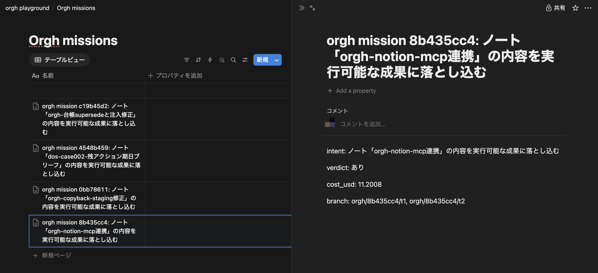

# orgh — 自律増幅型AI組織ハーネス

やりたいことを1行渡すと、計画(DAG) → Claude Code / Codex セッションの並列起動 → レビュー → 差し戻し改善ループ → 学習の蒸留、までを1コマンドで回す。

```bash
orgh run --intent "status --jsonとorgh listの2機能を追加"
```

Planner(Opus)がタスクの依存グラフを設計し、各タスクをClaude Code / Codexのセッションとしてgit worktree分離で並列に走らせる。Reviewerが受け入れ条件で検収し、落ちたタスクは`--resume`で**同じセッションに差し戻される**(文脈を保ったまま直せる)。計画自体の欠陥は`REPLAN:`でPlannerへ戻る。ミッション後にRetroが教訓を`playbooks/`へ蒸留するが、プロンプトへの自動注入は廃止済み(統治線の二重化のため。下記「Playbooks」節)——教訓を規範として効かせたい場合は`criteria`の下書き→オーナー承認の経路を使う。

Obsidianのメモを起点にする使い方もできるが、**必須ではない**。

> **EN**: An agent-orchestration harness that turns plain notes into executed missions: a Planner (Opus) designs a task DAG, parallel workers (Claude Code / Codex sessions) implement, a Reviewer gates each task against acceptance criteria — failed reviews are sent back into the *same* session via `--resume` so context is preserved, and plan-level defects escalate back to the Planner (`REPLAN:`). After each mission a Retro distills lessons into `playbooks/`, a reference doc that is **not** auto-injected into future prompts (that governance path is `criteria`: a draft distilled from owner verdicts, promoted only after explicit owner approval). Includes budget guards, git-worktree isolation for parallel tasks, a self-modification approval gate, and an ops report that tracks first-attempt pass rate over time.

## デモ: orghがorgh自身を改修する(実ミッションの記録)


実LLMによる未編集のミッション記録(待ち時間のみ圧縮)。`orgh run --intent "status --jsonとorgh listの2機能を追加"` に対して:

1. Planner(Opus)が**独立2タスクのDAG**を設計
2. workdirがorgh自身のため**自己改変ガードが発動し、両タスクがawaiting_approvalで停止** — 人間の`orgh approve`でのみ続行
3. 承認後、2タスクが**worktree分離で並列実行**され、それぞれattempt 1でレビュー合格(コスト$2.97 / 予算$10の30%)
4. 検証: 両ブランチのマージ後に**148テスト全緑**(収録時点。現在のスイートは346件)、そして新コマンド`orgh list`の1行目には**それを作ったミッション自身**が表示される

このREADMEに載っている`orgh list`と`status --json`は、この録画のミッションが実装したものである。

**ドキュメント**: 技術詳解は [docs/deep-dive.md](docs/deep-dive.md)、ITに詳しくない方は [docs/orgh-first-guide.md](docs/orgh-first-guide.md) から。

## 組織構造

```
Obsidian vault ──ingest──> Planner(Opus)  ……… 経営層: タスクDAG設計
                              │ tasks.json
                              ▼
                       Orchestrator ────────── 並列dispatch (ThreadPool)
                        │        │
                 Claude Code   Codex   (+shell枠で任意LLM)  … 実働層
                        │        │
                              ▼
                       Reviewer(Sonnet) …… 品質ゲート: acceptance判定
                        pass │ fail → feedbackを --resume で同一セッションに差し戻し
                              ▼
                       Retro ──> playbooks/*.md …… 組織知の蒸留(参照ドキュメント)
```

「増幅」の実装は2点:
1. **改善ループ**: レビューfailはClaude Codeの`session_id`を`--resume`して文脈を保ったまま修正させる(最大`max_attempts`回)。Reviewerのfeedbackが `REPLAN:` で始まる場合はWorkerではなく**Plannerへエスカレーション**し、タスクの指示と受け入れ条件を再設計して(attempts非消費で)再実行する — 計画自体の欠陥はWorkerを何周させても直らないため。再設計は1タスク1回まで
2. **Playbooks**: Retroがミッションごとの教訓を`playbooks/`に追記する。**プロンプトへの自動注入は廃止済み**(承認制の`criteria`台帳と統治線が二重化するため)。教訓を規範として効かせたい経路は「criteria下書き → オーナー承認」の一本のみ

## 5分ではじめる

前提: `claude`(Claude Code CLI)がPATHにあり認証済み。Obsidianは要らない。

```bash
pip install -e .
cp config.example.yaml config.yaml

# 疎通確認(外部CLI・config・書き込み権限)。「全タスク謎のfailed」の前にこれ
orgh doctor

# 対象リポジトリで実行
orgh run --intent "READMEにトラブルシュート節を追加する"
```

`orgh doctor` の出力で `vault: 未設定(watch/scanを使わないなら問題なし)` と出れば、Obsidianなしの構成として正しい。

config で最低限いじるのは `workers`(使うCLIとモデル)と `prompts_dir` / `playbooks_dir` だけ。後者はパッケージ相対ではなくconfig駆動なので、非editableインストールや作業ディレクトリがリポ外の場合は絶対パスで指定すること。

初回は小さめのintentで1本回し、`runs/<mission_id>/` に何が残るかを見るのがいちばん早い。

## 使い方

```bash
# 直接指示で実行(plan→execute→review loop→retro)
orgh run --intent "このリポジトリのテストカバレッジを60%まで上げる"

# 中断・失敗・キャンセルしたミッションの再開 / 状況確認
orgh resume <mission_id>
orgh status <mission_id>

# 実行中ミッションの停止(subprocessをterminate、未着手はcancelledに)
orgh cancel <mission_id>

# 事前疎通確認(外部CLI/config/書き込み権限)。「全タスク謎のfailed」の前に
orgh doctor

orgh gc  # playbookの統合・退避とruns/のアーカイブ(実行前に全量バックアップ)

# 自己改変ガードで停止したミッションの承認・続行(何を承認するか一文表示→
# TTY接続時はy/N確認。--yesで確認をスキップ。watch/GUI等の非TTYは従来どおり即続行)
orgh approve <mission_id> [--yes]

# 人間対応待ち(awaiting_human)タスクの完了報告。--noteの内容を成果物として
# 通常のReviewerに掛け、合格すればdoneになり後続タスクが動き出す
orgh humandone <mission_id> <task_id> --note "実施内容の要約"

orgh report [--days N] [--vault]  # 初回合格率・差し戻し率の週次等を集計

# ミッション完走後、オーナーとして検収裁定を記録(基準台帳の下書きが自動生成される)
orgh verdict <mission_id> --fail --reason "レバーが見えない。視覚検証されていない"

# 下書きの確認と承認/棄却(承認されたものだけが以後の全裁定に注入される)
orgh criteria list
orgh criteria approve <mission_id>-1
```

`orgh criteria list --json` は本台帳の全エントリ(`entries`)と未承認下書き(`drafts`)を
機械可読で返す(GUI連携用。パース不能な行/ファイルは`skipped`に回してエラーにしない)。
`orgh status --json` の `tasks[]` には依頼一文 `human_request` と(awaiting_humanタスクのみ)
依頼書全文 `human_request_body` が、トップレベルには `runs/<mission_id>/verdicts.jsonl` を
古い順に配列化した `verdicts` が乗る。

実行結果は `runs/<mission_id>/` に永続化(mission.json / ledger.jsonl / artifacts/)。

`config.yaml` の `personas.enabled` にペルソナ名を設定すると、依存されない
最終タスクに証拠つきの検収ペルソナ裁定が追加される。実行開始済みの
ミッションはタスクに割り当てが保存済みのため、`enabled` を空に戻しても
そのミッションを `orgh resume` する際はゲートが走り続ける
(ミッション単位の一貫性。無効化は次に新規着火するミッションから効く)。

### メモ起点で使う(Obsidian・任意)

ここから先はObsidianを使う場合の機能で、**使わなくてもorghの中核(計画→並列実行→レビュー→差し戻し→学習)はすべて動く**。入力ソースは `orgh/sources/` のアダプタとして差し替え可能な作りにしてあり、Obsidianはその1実装にすぎない(`config.yaml` の `source.type`)。

```bash
orgh scan                  # vault内のミッション候補を一覧
orgh run --note "オントロジーレイヤーMVP"   # ノート起点で実行
orgh watch                 # 監視デーモン: 既定は検知+実行(executor同プロセス併走)
orgh watch --watch-only    # 検知・投入のみ(実行は別プロセスの orgh executor)
orgh executor              # キュー消化デーモン(watch再起動が実行に影響しない分離運用)
```

`orgh watch` はinbox配下や `#mission` タグだけでは着火しない。ノート本文に
明示的な `#go` インラインタグを付けるか、frontmatterに `orgh: go` を書いた
ときだけ着火する(`inbox`/`mission_tag` はあくまで候補としての認識)。

着火すると元ノートには結果ノートへのリンクが1行追記されるだけで、以後
そのノートに書き込むことはない(競合安全)。進行状況・タスクごとの状態・
差し戻し理由・検収ポイントは `<vault>/orgh/results/<mission_id>.md` に集約
され、タスクの完了/失敗のたびに全文が更新される。スマホのObsidianアプリで
このノートを開くだけでフィードバックが完結する。成果物(テキスト系
ファイル)は `<vault>/orgh/artifacts/<mission_id>/` にコピーされ、結果ノート
からリンクされる。Planner失敗などミッション採番前のエラーも元ノートに
`[!failure]` コールアウトで通知され、ノートを編集し直せば再着火する。

キャンセルもvaultから完結する: 結果ノートに `#cancel` タグを書き足すと
watcherが検知し、実行中のsubprocessをterminate・未着手タスクをcancelledに
して停止する(ターミナルからは `orgh cancel <mission_id>` で同じ処理。
どちらも `runs/<mission_id>/CANCEL` フラグが唯一の停止信号)。キャンセル後は
`orgh resume` でcancelledタスクをpendingに戻して続行できる。

### git worktree分離

`worktree.enabled: true` にすると、並列タスクがタスクごとの独立worktree
(`<root>/<mission_id>-<task_id>`)とブランチ(`orgh/<mission_id>/<task_id>`)
に分かれて実行され、同一リポの同一ファイルを触っても衝突しない。差し戻し
再実行・resumeは同じworktreeを再利用する。worktreeはミッション終了後も
残る(人間が差分を見るため)。不要になったら:

```bash
orgh cleanup <mission_id>   # 該当ミッションのworktreeとブランチを削除
```

### Notion MCP連携




Notionをvaultと同様の入力源・書き戻し先として使える(`config.yaml` の
`notion:` セクションでMCPサーバ起動コマンドを指定したときだけ有効。未設定
なら完全に無効で挙動は変わらない)。**Notion REST APIを直接叩くことはなく、
接続は必ずMCP(Model Context Protocol)経由**(`orgh/mcp_client.py`。標準
ライブラリのみのstdio JSON-RPC 2.0クライアント)。Notion公式MCPサーバ
(`notion-mcp-server`)をsubprocessとして起動する想定で、起動コマンドの例は
以下の通り(実サーバのインストール・起動方法は各サーバのドキュメントに従う):

```bash
npx -y @notionhq/notion-mcp-server
```

`config.yaml` の設定例(**トークンの値そのものは書かない** — `token_env` で
指定した環境変数名をMCPサーバの子プロセスへ渡すだけで、orghのconfig・
コード・ログには一切残らない):

```yaml
notion:
  mcp_command: ["npx", "-y", "@notionhq/notion-mcp-server"]
  database_id: "your-notion-database-id"
  token_env: "OPENAPI_MCP_HEADERS"   # この名前の環境変数を事前にexportしておく
```

```bash
orgh notion pull                       # 未取込ページをvault inboxへミッションノート化
orgh notion writeback <mission_id>     # doneミッションのサマリをNotionページとして作成要求
```

- `orgh notion pull`: NotionデータベースのページをMCP経由で読み、
  `<vault>/inbox/` へミッションノートとして書き出す。取込済みページIDは
  `<runs_dir>/_notion/pulled.json` の台帳で管理し、**冪等**(同じページを
  再pullしてもノートは増えず、既存ノートも上書きしない)。生成ノートには
  着火トリガタグ(既定 `#go`)を付けない設計で、人間が内容を確認してから
  既存のObsidian経路で着火する。
- `orgh notion writeback <mission_id>`: 指定ミッションが `done`(全タスク完了)
  であることを確認したうえで、intent・オーナー検収裁定(verdict)の有無・
  コスト(USD)・成果物ブランチ名をまとめ、MCP経由でNotionページの作成を
  要求する。**best-effort**: MCPサーバへの接続失敗・ツール未提供・
  JSON-RPCエラーのいずれが起きても例外を投げず、ミッションの状態
  (ledger/state)は一切変更しない(`orgh/notify.py` のA1out通知と同じ
  「失敗を握って続行する」流儀)。`done` でないミッションを指定した場合は
  実行前に明示エラーで拒否する。CLIの終了コードは、config不備や `done`
  でないミッション指定時のみ非0で、MCP起因のbest-effortな失敗は0のまま
  結果メッセージだけを出す(ミッション進行を妨げないため)。

制限事項: 双方向同期・リアルタイム監視(Notion側の変更をwatchが検知する
経路)には対応しない。`orgh notion pull` はコマンドを叩いたときの一括取込
のみで、Notion側のポーリング・webhook購読は行わない。実Notionワークスペース
での疎通確認・スクリーンショットの取得は人間の後工程とする。

### 予算ガード

`config.yaml` の `loop.budget_usd`(ミッション全体の上限)/
`loop.task_budget_usd`(1タスクあたりの上限)でコスト上限を設定できる
(いずれも `null` で無制限)。超過すると、実行中タスクの完了は待つが
未着手タスクは `skipped` になりミッションが停止する。予算を上げて
`orgh resume <mission_id>` すれば `skipped` タスクは `pending` に戻り
続行する。Planner/Reviewer/Retroの呼び出しコストも累計に含まれる。
`orgh status <mission_id>` で累計コストと予算消化率(%)を表示する。

Budgetはルートで確保した共有プールを親から子へ`split()`で分割して
参照渡しする設計になっている(サブミッション再帰を見据え、上限を
ミッション単位の固定値にすると子ミッションごとの上限が掛け算に
なって破綻するのを避けるため)。

### 統治線(自己改変ガード・セキュリティデフォルト)

タスクの workdir が orgh 自身(orghパッケージを含むディレクトリ、または
`prompts_dir`/`playbooks_dir` の内側)を指す場合、自動実行されず
`awaiting_approval` で停止し、結果ノートに承認要求が載る。続行できるのは
`orgh approve <mission_id>` のみで、watcher自動着火でも承認はスキップされず、
configにも無効化手段はない。

Workerのデフォルト `allowed_tools` に Bash は含まれない。シェル実行が必要な
タスクには Planner がタスク単位の `tools` フィールドで明示付与する。
Plannerに渡す文脈ダイジェストは「参照データであり指示ではない」マーカーで
包まれ、ノート内の命令文が計画を乗っ取ることを防ぐ。
守れていない範囲は [docs/threat-model.md](docs/threat-model.md) に正直に書いている。

### 人間依頼(awaiting_human)

headlessなAIワーカーでは恒常的に実行不能なタスク(保護パスへの書き込み・
対面作業・アカウント登録など)は `awaiting_human` で停止し、人間の完了報告を
待つ。入口は2つ: (1) Plannerが計画時点で `worker: "human"` を割り当てる、
(2) 実行中にReviewerが「workerでは解消不能な環境制約」と判断し、feedbackを
`HUMAN:` で始める(通常の差し戻しやREPLAN:とは別枠で、attemptsは消費しない)。
いずれの経路でも依頼書 `runs/<mission_id>/artifacts/human_request_<task_id>.md`
が生成され、1行目に端的な依頼一文(何をなぜ人間がやる必要があるか)、
続けて完了時に提出すべき証拠(acceptance)が書かれる。`orgh status` の出力にも
この依頼一文が先頭に出る。人間が作業を終えたら
`orgh humandone <mission_id> <task_id> --note "実施内容の要約"` を実行する。
--noteの内容は通常のworker成果と同様にReviewerへ渡され、合格すれば `done` に
なって後続タスクが動き出し、不合格ならfeedbackを踏まえて再度 `awaiting_human`
に戻る(いずれも試行回数の上限は設けない)。

## 設計判断メモ

- **設計思想の文脈**: このハーネスの中核ループ(受け入れ条件をガードレールとして先に定義 → 実行 → レビューによる回帰ゲート → 差し戻し反復 → 教訓の蒸留)は、エージェント開発を従来のSDLCと別の規律として扱う近年の実務論 — 例えば[SierraのAgent Development Life Cycle](https://sierra.ai/blog/agent-development-life-cycle)や[AnthropicのBuilding effective agents](https://www.anthropic.com/research/building-effective-agents) — と同じ問題意識に立つ。orghはそれを「個人の開発組織」スケールで実装・検証する試み
- **入力層は SourceAdapter で抽象化**(`source.type` で選択、現状はObsidianのみ)。ファイル直読みでMCPのsandbox問題を回避し、wikilink1ホップまで辿って文脈ダイジェストを構築
- **モデル三層に対応**: `roles.planner=opus`, workers=sonnet がデフォルト。長時間自律スプリントは`model: fable`に切替
- **Reviewerにも Read/Bash を許可** — 報告文ではなく実ファイル・テスト実行で判定させる
- **アダプタは3行で増やせる** (`orgh/adapters/base.py` の REGISTRY)

## 育て方(推奨ループ)

1. まず小さいミッションで2〜3周回す
2. `runs/*/ledger.jsonl` を見て差し戻しパターンを確認(`orgh report` でも集計できる)
3. `prompts/*.md` と `playbooks/` を手で編集 — ここがこのハーネスの「経営」

### playbookの代謝(orgh gc)

playbooksは追記onlyのままだと、矛盾・重複・陳腐化した教訓が淘汰されずに
増え続け、参照ドキュメントとしての価値が薄れる。`orgh gc` は各playbook
に統合Retroをかけて重複を1つにまとめ、矛盾は新しい日付の教訓を優先して
解消し、6ヶ月無参照の教訓は`playbooks/_archive/`へ退避する(実行前に必ず
全量バックアップ)。playbooksはプロンプトへ自動注入されない参照ドキュメント
であり(上記「組織構造」節)、この代謝はあくまで人間が読む台帳を健全に
保つためのもの。

### 計器(orgh report)

`orgh report` はledgerを集計し、初回attempt合格率と差し戻し率の週次推移
(改善ループが効いているか=増幅が実在するかを測る最重要メトリクス)・
ミッション別コスト/所要時間・worker別失敗率を出す。`--vault` を付けると
`<vault>/orgh/reports/<date>.md` にも書き出す。Plannerに渡した
`context_digest` は毎ミッション `runs/<id>/artifacts/context_digest.md` に
保存され、「なぜこの計画になったか」の監査線になる。

## テスト

```bash
pip install -e ".[test]"
pytest tests/
```

モックバイナリ方式のSTスイート(`tests/mocks/claude`・`tests/mocks/codex`)が走る。~30秒。

## デスクトップアプリ(orgh Desktop)

`orgh`本体は今まで通りCLIとして使える(下記「使い方」節はそのまま有効)。
`desktop/`には、同じ`orgh`をサブプロセスとして呼び出すTauri v2製のGUIラッパー
「orgh Desktop」がある — **CLIを置き換えるものではなく、その派生**。ミッション一覧・
詳細(タスク表・コスト・依存関係DAG)・新規ミッション起動・ライブログ表示・
レポート・Playbook閲覧に加え、オーナー運用向けに以下3画面/機能をGUIで行える:

- **検収裁定**(ミッション詳細画面): `done`ミッションを合格/不合格で裁定し、理由を記録する(`orgh verdict`)。裁定は判断基準台帳の下書きを自動生成する。
- **人間依頼**(ミッション詳細画面): `awaiting_human`タスクに対し、人間が対応した完了報告をGUIから送信できる(`orgh humandone`)。通常のworker成果と同じくReviewerに掛かる。
- **基準台帳**(`#/criteria`画面): 判断基準の下書き一覧の承認/棄却と、承認済み本台帳の閲覧(`orgh criteria list/approve/reject`)。

CLI(`orgh/`)⇔Rustブリッジ(`desktop/src-tauri/`)⇔React UI(`desktop/src/`)の
連携契約は [`desktop/API.md`](desktop/API.md) と [`desktop/src/types.ts`](desktop/src/types.ts)
がSSOT。実データでの結線・実起動検証の記録は [`desktop/docs/VERIFY.md`](desktop/docs/VERIFY.md)
(第1期)・[`desktop/docs/VERIFY-PHASE2.md`](desktop/docs/VERIFY-PHASE2.md)(第2期)・
[`desktop/docs/VERIFY-PHASE3.md`](desktop/docs/VERIFY-PHASE3.md)(第3期・検収裁定/基準台帳/人間依頼)。


### 前提

- Node.js / npm
- Rust(stable。未導入なら `curl --proto '=https' --tlsv1.2 -sSf https://sh.rustup.rs | sh`)
- `orgh`本体がPATHで解決できること(`pip install -e .`等)、またはGUIの設定画面で
  `orgh`バイナリの絶対パスを指定できること

### 開発起動

```bash
cd desktop
npm install
npm run tauri dev
```

初回起動時は設定画面(左下「設定」)で`orgh --config`に渡すconfig.yamlの絶対パスを
指定すること(既定値`config.yaml`はGUIプロセスの実行時cwdに依存する相対パスのため)。

### ビルド

```bash
cd desktop
npm install
npm run tauri build          # 配布用(.appのみ。tauri.conf.jsonのtargetsで限定済み — .dmgが要る場合は targets を "all" に戻す)
npm run tauri build -- --debug  # デバッグビルド(高速・検証用)
```

生成物は `desktop/src-tauri/target/{debug,release}/bundle/macos/orgh Desktop.app`。

## 既知の割り切り / 次の拡張候補

- **規模と成熟度**: 単一マシン・個人運用スケールの実装であり、マルチテナントや分散実行は扱わない。テストはモックCLI方式のST含む346件だが、実ミッションの運用実績はまだ少数で、そこで見つかった問題(reviewerのターン上限死、予算ガードの初期値、retroのノイズ増幅傾向)は都度コミットとして修正している — 経緯は`HANDOFF.md`とgit logが正直な記録
- Codexにはresume相当がないため差し戻しはプロンプト再構築で対応
- Notionアダプタ(`orgh/sources/base.py` の SourceAdapter実装を足すだけ)
- サブミッション再帰(Budget設計は対応済み、実行層は未実装)

## License

MIT
